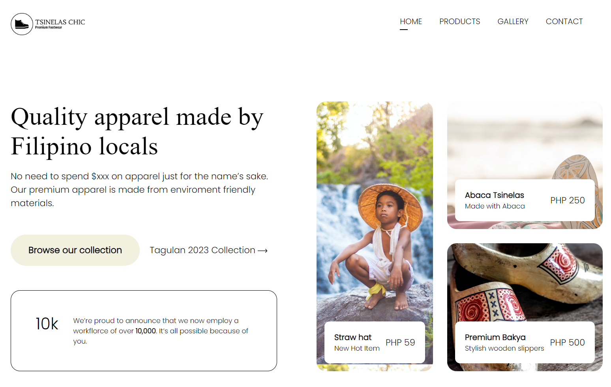

# Ecommerce Landing Page - README

This is a simple ecommerce landing page created using HTML and CSS. The page showcases various products and provides a brief introduction to the online store. The images used in this project were sourced from [Pexels](https://www.pexels.com/) and the logo was generated using [Logo.com AI](https://app.logo.com/).

## Developer

This project was developed by [Your Name](https://github.com/carpejemme).

## Workshop Details

- **Date:** August 17, 2023
- **Time:** 6:00 PM - 8:00 PM
- **THIS IS FREE WORKSHOP BY UPLIFT CODE CAMP**

## Features

- Clean and responsive design.
- Attractive hero section with a prominent call-to-action.
- Display of featured products with images and brief descriptions.
- Navigation bar with links to different sections.
- Use of custom CSS for styling, ensuring a unique look and feel.

## Technologies Used

- HTML
- CSS

## Installation

1. Clone this repository: `git clone https://github.com/carpejemm/tsinelas-chic.git`
2. Open the project folder in your preferred code editor.
3. Open `index.html` in your browser to see the landing page. or Open use `Live Server` extension by clicking `Go Live` in the lower right of your VS Code.

## Usage

Feel free to customize and extend this landing page for your own ecommerce project. Update the product details, images, and content as needed.

## Credits

- Product images: [Pexels](https://www.pexels.com/)
- Logo design: [Logo.com AI](https://app.logo.com/)

## License

This project is licensed under the [MIT License](LICENSE).
